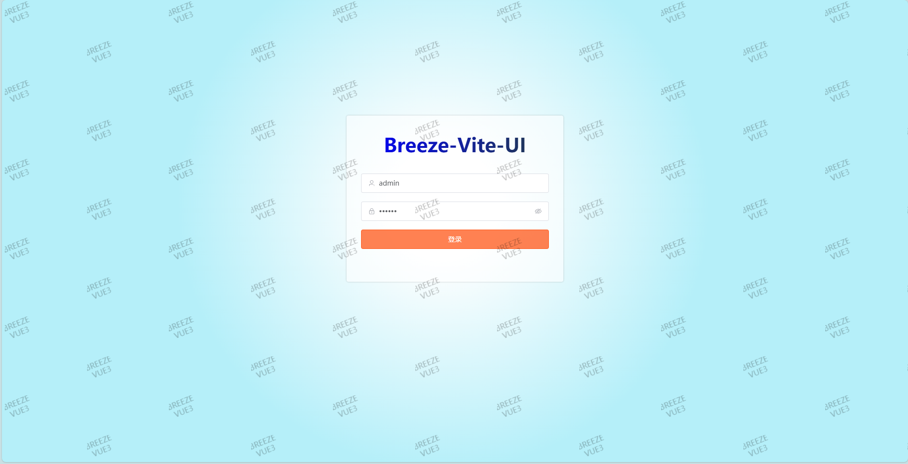
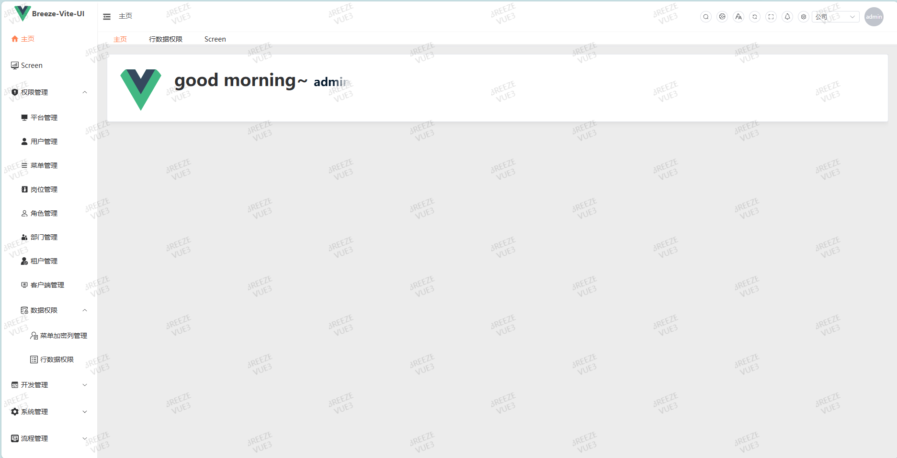
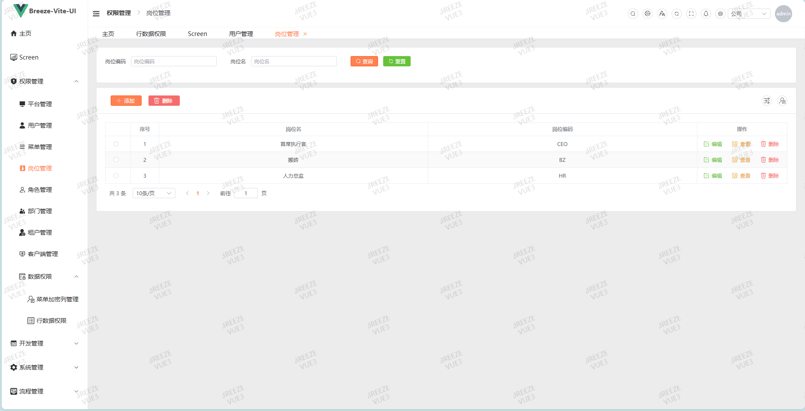
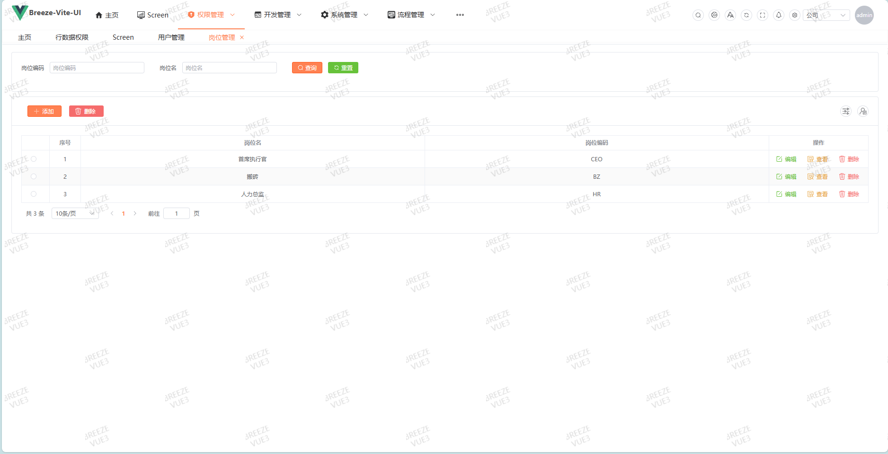
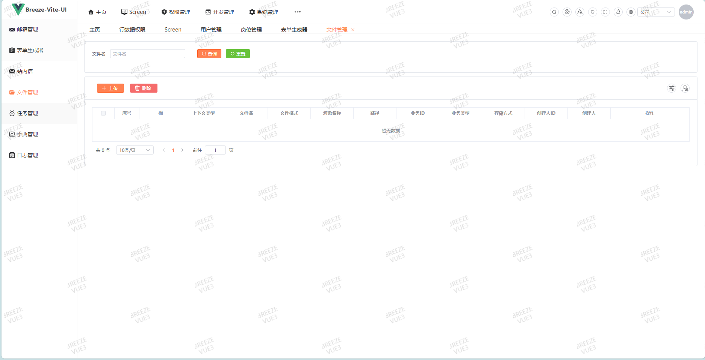
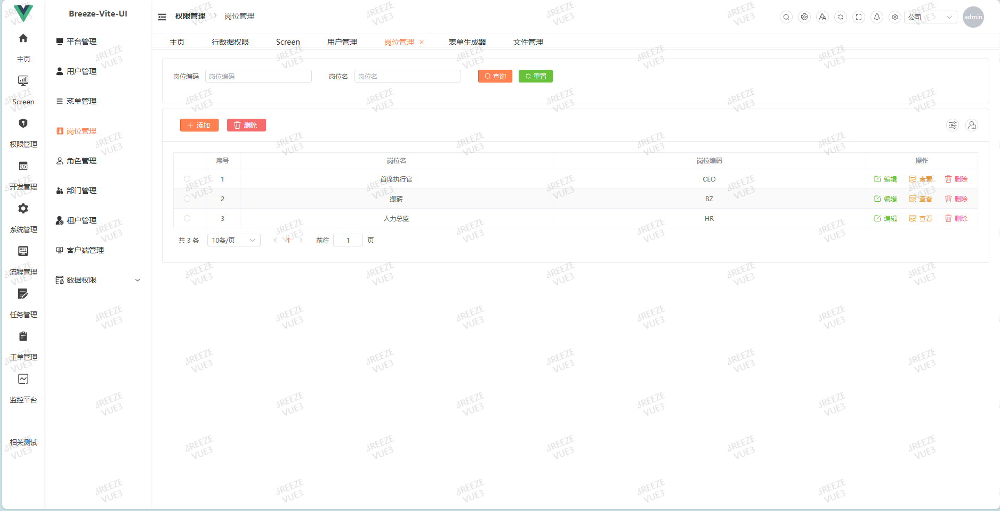

# Breeze-Boot-satoken
### 平台简介

##### Breeze-boot 是基于RBAC的权限管理系统，包括用户管理、角色管理、菜单管理、权限管理，使用bpmnJS绘制Flowable流程图等功能，适合Java开发者入门学习或者直接用此项目。

- 前端采用Vue、Element UI PLUS、VITE、TypeScript、bpmn-process-designer（bpmjs）。
- 后端采用Spring Boot3 JDK17、Spring Security + spring-security-oauth2-authorization-server、Flowable（审批流程）、Redis、Jwt、Druid。
- 权限认证使用Jwt、支持按钮级别的权限控制
- 支持加载动态权限菜单。
- 前端代码，请移步
    - [github：vue + vite + TS 版本](https://github.com/Memory1998/breeze-vite-ui.git)
    - [gitee: vue + vite + TS 版本]( https://gitee.com/memoryGiter/breeze-vite-ui)

### 特别鸣谢：
- [验证码： https://gitee.com/anji-plus/captcha](https://gitee.com/anji-plus/captcha)
- [流程设计器： https://gitee.com/MiyueSC/bpmn-process-designer](https://gitee.com/MiyueSC/bpmn-process-designer)
- [流程设计器：VUE3版本 https://gitee.com/xlys998/bpmn-vue3](https://gitee.com/xlys998/bpmn-vue3)

# 请遵循 Apache 2.0 协议

### 代码结构

- breeze-boot \
  ├─ breeze-boot \
  │ ├─ src \
  │ │ ├─ src\java\com\breeze\boot\..\modules\bpm    【任务流相关的包】 \
  │ │ ├─ src\java\com\breeze\boot\..\modules\system 【系统相关的包】 \
  │ │ ├─ src\java\com\breeze\boot\..\modules\auth   【权限相关的包】 \
  ├─ breeze-base \
  │ ├─ breeze-base-core \
  │ ├─ breeze-base-log \
  │ ├─ breeze-base-mail \
  │ ├─ breeze-base-oss-s3 \
  │ ├─ breeze-base-security \
  │ ├─ breeze-base-validator \
  │ ├─ breeze-base-message\
  │ ├─ breeze-base-redis-cache\
  │ ├─ breeze-base-mail \
  │ ├─ breeze-base-xss  \
  │ ├─ breeze-base--doc  \
  │ ├─ breeze-...
  ├─ breeze-monitor                                  监控服务（SpringBoot项目）】 \
  ├─ flowable-ui-app-server                         【Flowable-UI官方项目 可启动】

### 前端界面相关

### 登录页

### 首页

### 布局1

### 布局2

### 布局3

### 布局4

### flowable bpmn

